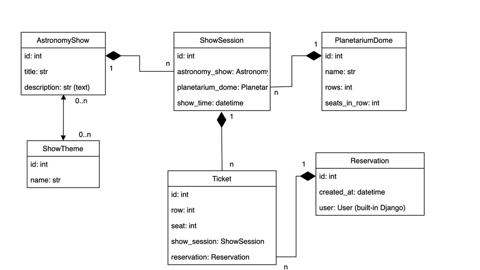

## Planetarium API service 🌍

> 👉 **Step 1** - Download the code from the GH repository (using `GIT`) 

```bash
$ git clone https://github.com/Artemh59/Planetarium_API.git
$ cd Planetarium
```

<br />

> 👉 **Step 2** - Start the APP in `Docker`

```bash
$ docker-compose up --build 
```

The app runs at `http://127.0.0.1:8000/`. 

<br />

> `Accessing API` </br>
</br>
> Creating user:
/api/user/register/ </br>
</br>
> Get access token:
/api/user/token/


> DB structure
</br>
> 
