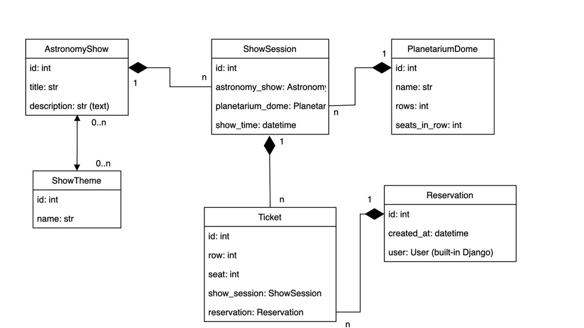

# Planetarium API Service

## Getting Started

To get started with the Planetarium API Service, follow these steps:

1. Clone the repository:
   ```bash
   git clone https://github.com/Artemh59/Planetarium_API.git
   ```
2. Navigate to the project directory:
   ```bash
   cd Planetarium
   ```
3. Set up the environment variables:

   Create a .env file based on the provided .env.example.


4. Start the server:
   ```bash
   python manage.py runserver
   ```

## Run with Docker

1. You need to install docker and run next: 
   ```bash
   docker-compose build
   docker-compose up
   ```
   
## Accessing API:
1. `
Creating user:
/api/user/register/
`


2. `
Get access token:
/api/user/token/
`

## DB Structure:

